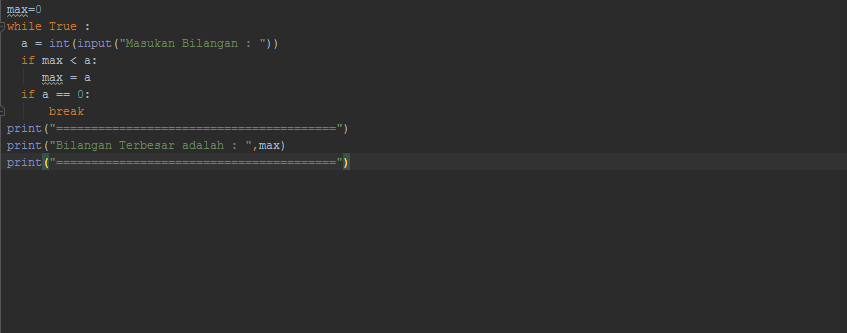
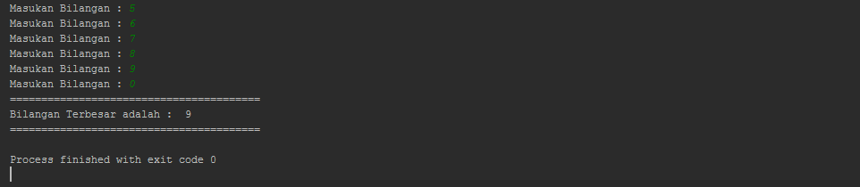

# =================Latihan 1================= #
## =========Menampilkan n bilangan acak yang lebih kecil dari 0.5========= ##

- Pengacakan, pembangkit bilangan acak, atau random dapat digunakan untuk berbagai macam hal.
Salah satunya adalah untuk memecahkan kasus Monte Carlo.
Nilai random kadang dibutuhkan juga untuk menentukan suatu pilihan.
Atau digunakan juga untuk membuat id yang ditambahi dari string asal.
Randomisasi juga dapat digunakan untuk mengacak suatu tampilan produk, atau digunakan saat proses pelatihan sebuah mesin cerdas.
Di Python untuk melakukan random cukup mudah.
Dimana kamu hanya perlu menggunakan library bawaan Python yaitu random.

		 _**import random**_

		 _**a = random()**_

		 _**print(a)**_

- Perulangan for
Perulangan for disebut juga sebagai counted loop (perulangan yang terhitung), yaitu
perintah yang dieksekusi secara berulang berdasarkan jumlah perulangan tertentu.

		 _**for x in range (start,stop)**_

## Hasil Eksekusi ##

# =================Latihan 2================= #
## =====Menampilkan bilangan terbesar dari n buah data yang diinputkan===== ##

- Perulangan while
Perulangan while disebut uncounted loop (perulangan yang tak terhitung), yaitu perulangan
yang dilakukan berdasarkan kondisi tertentu selama nilai kondisi bernilai TRUE.

## Hasil Eksekusi ##

